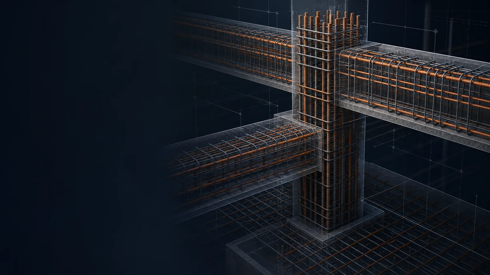

# RebarViz · 钢筋平法识图 3D 可视化

基于 22G101 图集的钢筋平法学习与配筋分析工具。输入平法标注或自然语言参数，即时生成可交互的三维配筋模型，并同步查看截面、构造校验与工程量估算。

[](https://nextjs.org/)
[](https://react.dev/)
[](https://threejs.org/)
[](LICENSE)

> [在线体验](https://rebar-viz-brucelee1024s-projects.vercel.app) · 当前部署可能需要 Vercel 访问权限。



## 核心能力

- **3D 交互识图**：旋转、缩放、平移、构件高亮与剖切，从任意角度观察配筋构造。
- **平法标注解析**：解析钢筋等级、直径、数量、间距、排布与箍筋肢数。
- **AI 配筋助手**：通过自然语言生成或调整配筋，支持连续对话、多步工具调用与方案应用。
- **图纸智能识别**：识别 CAD 截图、平面图、截面图、配筋详图、柱表及手绘草图。
- **多模型接入**：支持 DeepSeek、通义千问、Kimi、OpenAI 与 Xiaomi MiMo 系列模型。
- **计算与校验**：提供配筋率、锚固长度、钢筋用量、混凝土用量、规范提示和方案对比。
- **下料数据导出**：可将钢筋明细导出为 CSV，或生成适合打印和另存 PDF 的页面。

## 支持构件

| 构件 | 常用编号 | 已覆盖能力 |
| --- | --- | --- |
| 框架梁 | KL | 集中/原位标注、多跨与变截面、支座负筋、加密区、端部锚固 |
| 框架柱 | KZ | 角筋/中部筋分项标注、A–F 型复合箍、加密区、搭接与变截面 |
| 楼板 | LB | X/Y 向底筋、面筋与分布筋 |
| 梁柱节点 | Joint | 节点核心区、梁筋锚固与节点区箍筋 |
| 剪力墙 | Q | 竖向/水平分布筋与边缘构件 |
| 楼梯 | AT / BT | 梯板、平台和分布筋，支持施工步骤演示 |
| 独立基础 | DJ | 单柱/双柱基础、底筋、顶筋与柱插筋 |
| 条形基础 | TJ | B/T 配筋、分布筋及梁式/墙式条基 |
| 承台 | CT | 多桩布置、底筋、柱插筋与桩顶连接 |
| 筏形基础 | FB | 柱网、双向底筋/顶筋、柱插筋及常见筏板构造 |

## 快速开始

环境要求：Node.js 20 或更高版本。

```bash
git clone https://github.com/BruceLee1024/RebarViz.git
cd RebarViz
npm install
npm run dev
```

打开 [http://localhost:3000](http://localhost:3000)。

常用命令：

```bash
npm run dev      # 启动开发服务器
npm run lint     # 运行 ESLint
npm run build    # 创建生产构建
npm run start    # 启动生产服务器
```

## AI 功能配置

在应用的「设置」页面添加任意受支持服务商的 API Key。Key 默认仅保存在当前浏览器本地；部分服务商在浏览器直连受限时，请求会通过应用的 `/api/chat` 代理转发。

| 服务商 | API Key / 控制台 |
| --- | --- |
| DeepSeek | [platform.deepseek.com](https://platform.deepseek.com/api_keys) |
| 通义千问 | [阿里云百炼](https://bailian.console.aliyun.com/) |
| Kimi | [Moonshot 开放平台](https://platform.moonshot.cn/console/api-keys) |
| OpenAI | [OpenAI API](https://platform.openai.com/api-keys) |
| Xiaomi MiMo | [MiMo 开放平台](https://platform.xiaomimimo.com/) |

详细说明见 [API 配置帮助](docs/api-help.md)。API Key 不等于已开通额度，模型调用产生的费用由对应服务商收取。

## 22G101-3 基础专题

[22G101-3 基础专题整理](docs/22G101-3-foundation-notes.md) 汇总了页码速查、构造要点、设计需注明事项与产品化建议。当前应用已覆盖独立基础、条形基础、承台和筏形基础的主要学习场景。

## 技术栈

- [Next.js 16](https://nextjs.org/) 与 [React 19](https://react.dev/)
- [Three.js](https://threejs.org/) 与 [React Three Fiber](https://r3f.docs.pmnd.rs/)
- [Tailwind CSS 4](https://tailwindcss.com/)
- TypeScript、React Compiler、Lucide Icons

## 使用说明

RebarViz 用于平法识图、构造理解和方案辅助分析，不替代现行规范、图集原文、设计文件或注册工程师审核。计算结果仅供学习与方案参考，不得直接作为工程设计、施工或结算依据。

## 许可证

Copyright © 2025–2026 BruceLee1024

本项目采用 [CC BY-NC 4.0（署名—非商业性使用 4.0 国际）](LICENSE) 许可。你可以在保留署名和来源链接的前提下分享、修改本项目，但不得用于商业目的；衍生内容应以相同许可方式发布。
